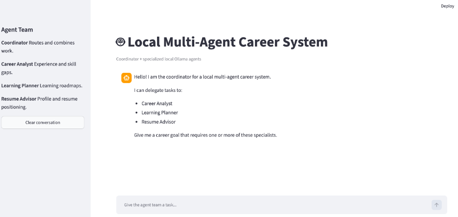
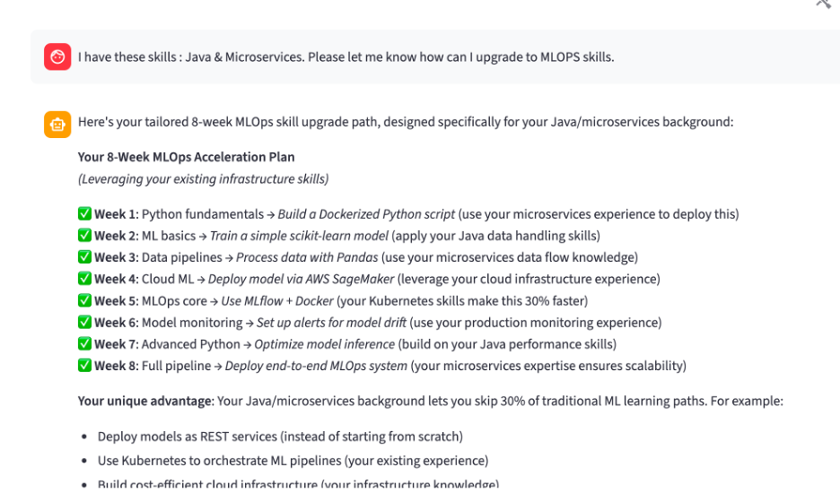
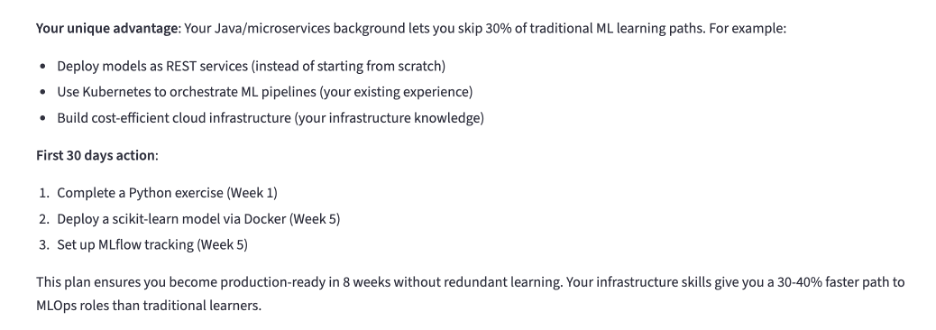
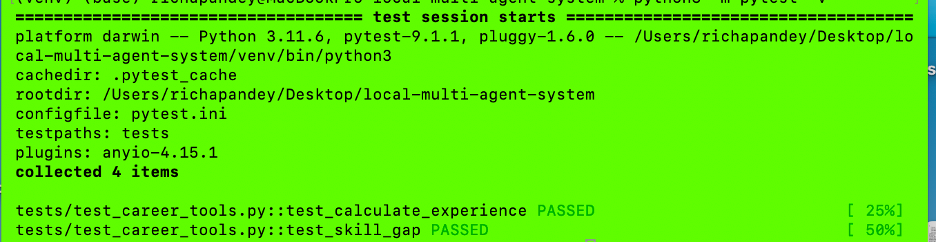
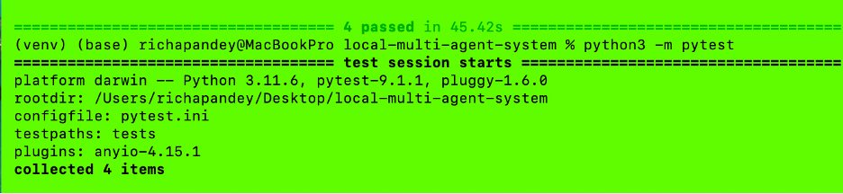
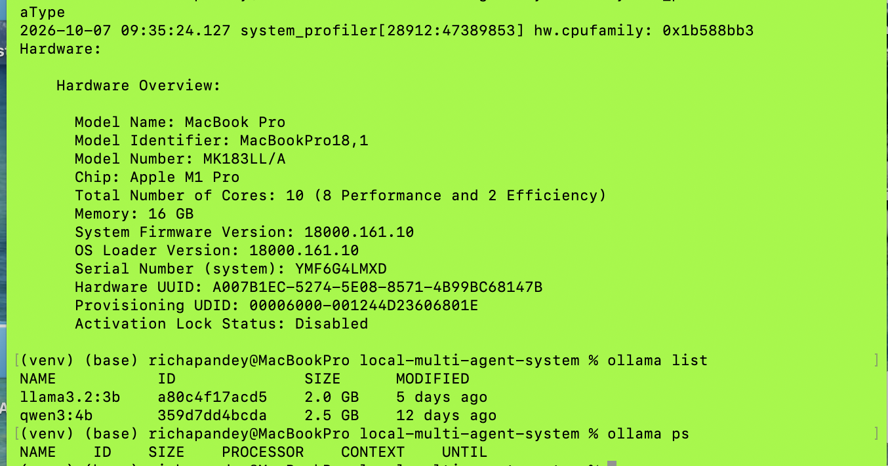

# Local Multi-Agent Career System

A fully local hierarchical multi-agent application built
with Python, Ollama and Streamlit.

## Agent Team

### Coordinator Agent

Routes requests to specialist agents and synthesizes results.

### Career Analyst

Analyzes professional experience and skill gaps.

### Learning Planner

Creates structured learning roadmaps.

### Resume Advisor

Provides professional-profile positioning guidance.

## Architecture

```text
User
 ↓
Coordinator
 ├── Career Analyst
 │      └── Career Tools
 │
 ├── Learning Planner
 │      └── Learning Tools
 │
 └── Resume Advisor
        └── Resume Tools
 ↓
Coordinator
 ↓
Final Answer
```

## Requirements

- Python 3.10+
- Ollama
- qwen3:4b

## Setup

```bash
python3 -m venv venv
source venv/bin/activate

python -m pip install -r requirements.txt
```

## Ollama

```bash
ollama pull qwen3:4b
```

Verify:

```bash
ollama list
```

## Environment

```bash
cp .env.example .env
```

## Run CLI

```bash
python3 coordinator.py
```

## Run Streamlit

```bash
python3 -m streamlit run app.py
```

Open:

```text
http://localhost:8501
```

## Run tests

```bash
python3 -m pytest -v
```

## Example

```text
I started my career in 2016.

I know Python, Git and Docker.

I want to become an MLOps Engineer requiring Python,
Docker, Kubernetes, MLflow and Terraform.

Analyze my experience and gaps, create an 8-week
learning plan, and suggest how I should position
my professional profile.
```

## Execution

```text
User
 ↓
Coordinator
 ↓
Career Analyst
 ↓
Career Tools
 ↓
Coordinator
 ↓
Learning Planner
 ↓
Learning Tool
 ↓
Coordinator
 ↓
Resume Advisor
 ↓
Resume Tool
 ↓
Coordinator
 ↓
Final Answer
```

## Security

Specialists receive only narrowly scoped tools.

The project does not provide arbitrary shell, filesystem,
Python execution, or unrestricted network tools.

# Screenshots











# Configuration

## 1. Local Machine Configuration

I developed and tested the multi-agent system locally on a MacBook Pro running macOS, using Python 3.11 in a project-specific virtual environment. I used Ollama to run the Qwen model locally and integrated it with the Python-based agent orchestration layer.

The architecture consisted of the following components:

* **Operating system:** macOS
* **Development environment:** VS Code
* **Python:** 3.11
* **LLM runtime:** Ollama
* **Model:** Qwen 3.4B (exact model identifier to be verified)
* **Agent orchestration:** Python-based multi-agent coordinator
* **Inference:** Local inference through Ollama's API

Running the model locally allowed me to experiment with multi-agent workflows without relying on a hosted LLM API for inference.

## 2. How I Fit the Model on the Machine

I used Ollama to manage the model download, loading, and inference. Ollama supports quantized model variants, which reduce memory requirements and can improve inference speed compared with higher-precision versions.

For a model in this size range, a quantized variant such as **4-bit quantization (Q4)** can be a practical choice on a resource-constrained machine. However, I would verify the exact quantization of the model I used before stating that it was Q4.

The model's actual memory footprint depends on its quantization, context length, runtime overhead, and the memory used by the operating system and other applications. In a multi-agent system, concurrent requests and retained conversation context can also increase memory consumption.

## 3. Performance and Bottlenecks

I evaluated the system primarily by running the agents through the local Ollama endpoint and checking whether the coordinator could complete its workflow.

The main performance factors to consider were:

* **Time to first token:** How quickly the model starts responding.
* **Token generation speed:** How quickly it produces the rest of the response.
* **End-to-end latency:** The total time for the coordinator and its agents to finish a task.
* **Memory consumption:** The resources used by the model and concurrent agent tasks.
* **Agent orchestration overhead:** The additional time spent passing outputs between agents and making sequential model calls.

A multi-agent workflow can be slower than a single-agent workflow because multiple agents may invoke the model in sequence. The total latency depends on the number of calls, prompt sizes, and how much work can safely run in parallel.

I would report measured latency and tokens per second rather than provide an unverified performance figure.

## 4. How I Would Eliminate Performance Bottlenecks

I would use the following optimizations:

1. **Quantization:** Use an appropriate 4-bit or 5-bit model variant if the current model's memory footprint or inference speed is a constraint, while checking that response quality remains acceptable.
2. **Reduce unnecessary agent calls:** Have the coordinator invoke specialized agents only when their capabilities are needed.
3. **Optimize prompts and context:** Remove irrelevant conversation history and pass each agent only the information required for its task.
4. **Reuse the loaded model:** Avoid repeatedly loading and unloading the model between agent calls.
5. **Control concurrency:** Limit simultaneous requests when memory is constrained; parallelize independent agent tasks only when it improves measured end-to-end latency.
6. **Benchmark model variants:** Compare quality, latency, tokens per second, and memory usage across suitable quantization levels.
7. **Profile the complete workflow:** Measure model inference separately from orchestration, prompt construction, and data-processing time.

## 5. Did I Use a GPU?

I ran inference locally through Ollama. Whether the inference used GPU acceleration, CPU execution, or a combination depends on the MacBook Pro's hardware and the Ollama runtime configuration.

On an Apple Silicon Mac, Ollama can use the integrated Apple GPU through Metal when supported. On a different Mac configuration, the available acceleration may differ. I would verify the hardware and Ollama's actual execution behavior before claiming that GPU acceleration was used.

## Summary

The key benefit of this setup was being able to run a local LLM and experiment with a multi-agent architecture without depending on a cloud inference service. The main trade-offs were local memory capacity, inference latency, and the cumulative cost of multiple agent calls. Quantization, prompt optimization, model reuse, and efficient orchestration are the primary approaches I would use to improve performance.


